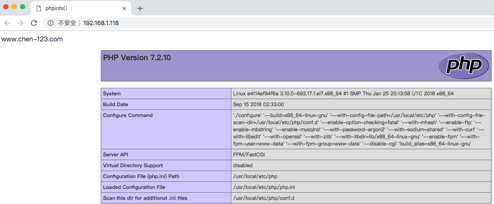
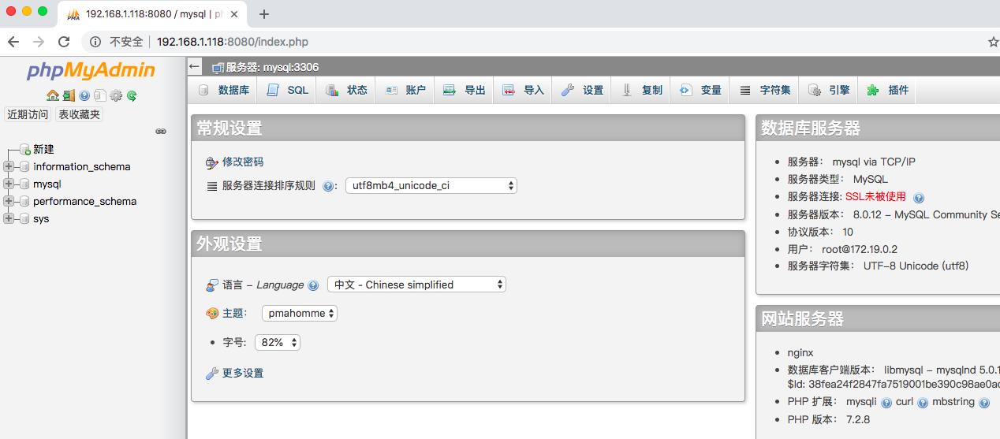
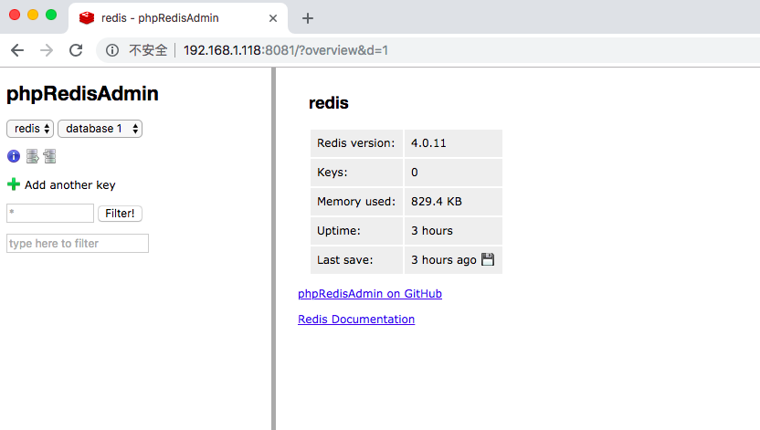
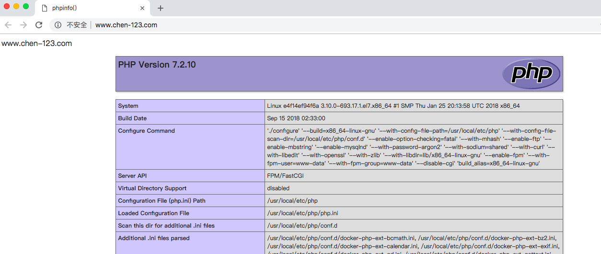
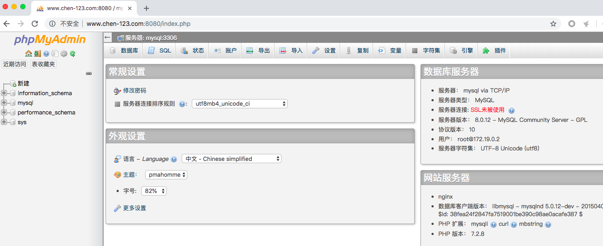
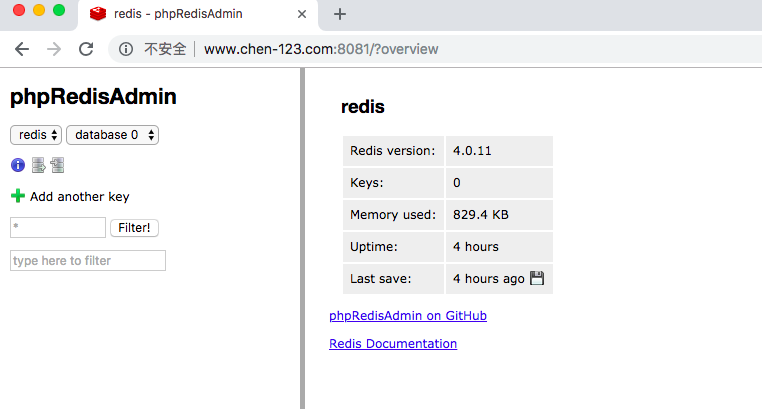

# LNMP运用环境说明

一、LNMP特点说明

1、支持多版本PHP环境，包括php5.4、php5.6、php7.2三个，其它版本根据需求定制,php-fpm运用在9000端口

2、支持绑定多域名，通过修改nginx、php-fpm配置，重启服务

3、代码、数据库文件、配置文件、日志等都持久化保持在主机服务器

4、支持https和http/2业务类型，支持php扩展安装，composer更新

5、一次配置，**Windows、Linux、MacOS都支持

6、LNMP开放80、443、8080、8081端口，绑定到主机服务器端口

二、LNMP结构

目录说明

```
.
├── conf					配置目录
│   ├── common_server.conf			公共安全nginx配置文件
│   ├── conf.d					站点配置目录
│   │   ├── certs				站点证书目录
│   │   │   └── www.phpdba.com			www.phpdba.com 证书目录
│   │   │       ├── gencert.sh			证书生存脚本
│   │   │       ├── www.phpdba.com.crt
│   │   │       ├── www.phpdba.com.csr
│   │   │       ├── www.phpdba.com.key
│   │   │       └── www.phpdba.com.origin.key
│   │   ├── www.chen-123.com.conf		www.chen-123.com Nginx配置文件
│   │   └── www.phpdba.com.conf			www.phpdba.com Nginx配置文件
│   ├── mysql.cnf				mysql 配置文件
│   ├── nginx.conf				nginx 主配置文件
│   ├── php-fpm.conf				php-fpm 配置文件
│   └── php.ini					php.ini 配置文件
├── docker-compose54.yml			php5.4 docker-compose 容器启动配置文件
├── docker-compose56.yml			php5.6 docker-compose 容器启动配置文件
├── docker-compose.yml				php7.2 docker-compose 容器启动配置文件
├── log						nginx 日志目录
│   ├── nginx.error.log
│   └── nginx_www_phpdba_com_error.log
├── mysql					mysql 数据目录
├── php						php 镜像需求dockerfile文件
│   ├── php54
│   │   ├── Dockerfile
│   ├── php56
│   │   ├── Dockerfile
│   └── php72
│       ├── Dockerfile
└── www						站点代码目录
    ├── www.chen-123.com			www.chen-123.com 代码资源目录
    │   └── index.php
    └── www.phpdba.com				www.phpdba.com 代码资源目录
        └── index.php
```

结构示意图：


# 快速使用

## 部署

1、本地安装git

```
[root@promote deploy-one-script]# yum install -y git
```

2、clone 项目

```
[root@promote ~]# git clone https://github.com/chen-123/deploy-one-script.git
正克隆到 'deploy-one-script'...
remote: Counting objects: 610, done.
remote: Compressing objects: 100% (465/465), done.
remote: Total 610 (delta 128), reused 610 (delta 128), pack-reused 0
接收对象中: 100% (610/610), 1.49 MiB | 240.00 KiB/s, done.
处理 delta 中: 100% (128/128), done.
[root@promote ~]# cd deploy-one-script/
[root@promote deploy-one-script]# mkdir pkg/run/v1.0 -p
[root@promote deploy-one-script]# cp *.sh pkg/run/v1.0/
[root@promote deploy-one-script]# ls
common.sh                  deploy_lnmp_k8s_test_prod.sh  etcd.sh  kubernetes.sh  README.md
deploy_lnmp_docker_dev.sh  docker.sh                     img      pkg            upgrade.sh
[root@chen-123 deploy-one-script]# tar cvf run-v1.0.tar.gz pkg/run/v1.0/
pkg/run/v1.0/
pkg/run/v1.0/kubernetes.sh
pkg/run/v1.0/upgrade.sh
pkg/run/v1.0/etcd.sh
pkg/run/v1.0/docker.sh
pkg/run/v1.0/deploy_lnmp_docker_dev.sh
pkg/run/v1.0/deploy_lnmp_k8s_test_prod.sh
pkg/run/v1.0/common.sh
[root@chen-123 deploy-one-script]# vim pkg/ansible/playbook/ansible_host.txt //修改ansible的hosts信息配置
[root@chen-123 deploy-one-script]# tar cvf ansible_playbook.tar.gz pkg/ansible/playbook/
a pkg/ansible/playbook
a pkg/ansible/playbook/file
a pkg/ansible/playbook/playbook.yml
a pkg/ansible/playbook/ansible_host.txt
a pkg/ansible/playbook/file/hosts.allow.j2
a pkg/ansible/playbook/file/authorized_keys.j2
a pkg/ansible/playbook/file/ssh_config.j2
a pkg/ansible/playbook/file/group.j2
a pkg/ansible/playbook/file/passwd.j2
a pkg/ansible/playbook/file/id_rsa.j2
a pkg/ansible/playbook/file/docker_config.json.j2
a pkg/ansible/playbook/file/hosts.j2
a pkg/ansible/playbook/file/hosts.deny.j2
```

3、启动

```
[root@promote deploy-one-script]# bash deploy_lnmp_docker_dev.sh --role deploy-lnmp-dev --hosts 192.168.1.118
...
192.168.1.118 docker install ok!
192.168.1.118 docker-compose install ok!
```

4、在浏览器访问

```
[root@client ~]#grep 'www.chen-123.com' /etc/hosts || echo "192.168.1.118 www.chen-123.com" >> /etc/hosts
```

IP访问





域名访问





5、代码修改查看效果

```
[root@promote www]# cd /root/pkg/docker-compose/yaml/www
[root@promote www]# ls
www.chen-123.com  www.phpdba.com
[root@promote www]# cd www.chen-123.com/
[root@promote www.chen-123.com]# ls
index.php
[root@promote www.chen-123.com]# vim chen-123.php
[root@promote www.chen-123.com]# cat chen-123.php 
<?php
echo "hi,chen-123!";
?>
[root@promote www.chen-123.com]#
```


## 切换PHP版本

默认情况下，我们同时创建 PHP5.4、PHP5.6和PHP7.2 三个PHP版本的容器，

切换PHP仅需修改 Nginx 的fastcgi_pass选项，

例如，示例的localhost用的是PHP5.4，Nginx 配置：

    fastcgi_pass   php54:9000;
    
要改用PHP7.2，修改为：

    fastcgi_pass   php72:9000;

## HTTPS 和 HTTP/2

1、修改hosts

```
[root@client ~]#grep 'www.chen-123.com' /etc/hosts || echo "192.168.1.118 www.chen-123.com" >> /etc/hosts
```

Linux和Mac的hosts文件位置： /etc/hosts

Windows的hosts文件位置： C:\Windows\System32\drivers\etc\hosts

然后通过浏览器这两个地址就能看到效果，其中：

www.chen-123.com和192.168.1.118是同一个站点，是经典的http站，

www.phpdba.com是自定义证书的https站点，浏览器会有安全提示，忽略提示访问即可。

## 日志

Log文件生成的位置依赖于conf下各log配置的值。

1、 Nginx日志

Nginx日志是我们用得最多的日志，所以我们单独放在根目录log下。

log会目录映射Nginx容器的/var/log/dnmp目录，所以在Nginx配置文件中，需要输出log的位置，我们需要配置到/var/log/dnmp目录，如：

```
error_log  /var/log/dnmp/nginx.site1.error.log  warn;
```

2、PHP-FPM日志
大部分情况下，PHP-FPM的日志都会输出到Nginx的日志中，所以不需要额外配置。

如果确实需要，可按一下步骤开启。

在主机中创建日志文件并修改权限：
```
$ touch log/php-fpm.error.log
$ chmod a+w log/php-fpm.error.log
```

主机上打开并修改PHP-FPM的配置文件conf/php-fpm.conf，找到如下一行，删除注释，并改值为：

```
php_admin_value[error_log] = /var/log/dnmp/php-fpm.error.log
```

重启PHP-FPM容器。

3、 MySQL日志
因为MySQL容器中的MySQL使用的是mysql用户启动，它无法自行在/var/log下的增加日志文件。所以，我们把MySQL的日志放在与data一样的目录，即项目的mysql目录下，对应容器中的/var/lib/mysql/目录。
```
slow-query-log-file     = /var/lib/mysql/mysql.slow.log
log-error               = /var/lib/mysql/mysql.error.log
```

以上是mysql.conf中的日志文件的配置。

## 使用composer

lnmp默认已经在容器中安装了composer，使用时先进入容器：

$ docker exec -it yaml_php_1 /bin/bash

然后进入相应目录，使用composer：

```
# cd /var/www/html/www.chen-123.com
# composer update
```

因为composer依赖于PHP，所以，是必须在容器里面操作composer的。

## phpmyadmin和phpredisadmin

本项目默认在docker-compose.yml中开启了用于MySQL在线管理的phpMyAdmin，以及用于redis在线管理的phpRedisAdmin，可以根据需要修改或删除。

1、 phpMyAdmin

phpMyAdmin容器映射到主机的端口地址是：8080，所以主机上访问phpMyAdmin的地址是：

http://www.chen-123.com:8080 或者 http://192.168.1.118:8080

MySQL连接信息：

host：(本项目的MySQL容器网络)
port：3306
username：root（手动在phpmyadmin界面输入）
password：123456 （手动在phpmyadmin界面输入）

2、 phpRedisAdmin

phpRedisAdmin容器映射到主机的端口地址是：8081，所以主机上访问phpMyAdmin的地址是：

http://www.chen-123.com:8081 或者 http://192.168.1.118:8080

Redis连接信息如下：

host: (本项目的Redis容器网络)
port: 6379

## 在正式环境中安全使用

要在正式环境中使用，请：

在php.ini中关闭XDebug调试

增强MySQL数据库访问的安全策略

增强redis访问的安全策略
